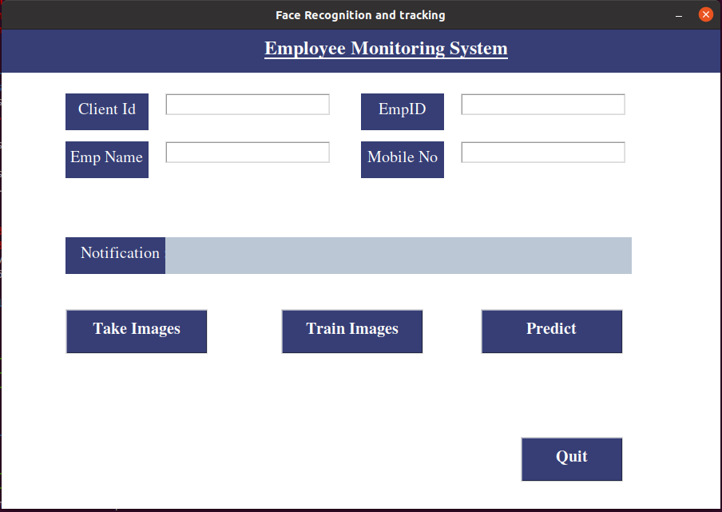

# Face Recognition Attendance System

During the covid-19 pandemic, we realized the importance of work from home and with this came a problem of tracking people attendance.
Keeping this problem in mind, I have developed a desktop application which will register a user along with his face image. After registering the user, it will train 
a deep neural network. 
During login, the system will capture the image of the user and based on the image, it will identify the user and mark its attendance.

## User Interface

Lets have a look at the above image:
*The user will input details related such as clientId, employeeId, name and phone_number
* After that user will click on Take Images button -> This will capture 30 images of user
* Then user will click on train Images button -> This will train a neural network on the user image.
* Now when user clicks on the predict button, we will use the pretrained model to identify the user and mark the attendace of the user in a text file.

Tech Stack Used:
* Tkinter -> This is used to develop the UI of the application
* MTCNN -> MTCNN model is being used to detect the user face while capturing images
* Pytorch -> pytorch is used to train the model and predict the results
* ONNX -> onnx is used to save the model file
* Opencv -> opencv is used to capture user image.

## How To use
To use the application you need to follow the following steps
* Clone the github repository
* create a virtual env using  ``conda create -n <env name>``
* activate the environment `conda activate <env name>`
* install the dependencies using the command `pip install -r requirements.txt`
* run the command `python3 app.py` to launch the application 
